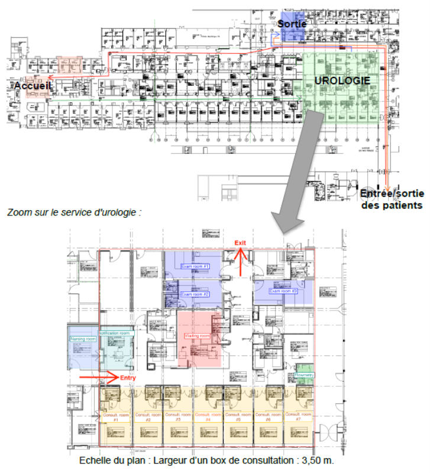
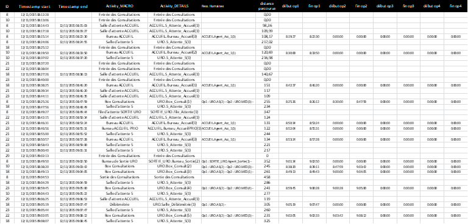

# Etude de cas sur l’analyse et la mesure de performance des Flux de Patients

## Introduction

Ce travail porte sur l'analyse des flux de patients sur un plateau mutualisé de consultations externes d'un hôpital. 
L'objectif est de réaliser un diagnostic objectif de la performance organisationnelle du service d'urologie en s'appuyant sur les méthodes et outils d'analyse de flux vus précédemment ainsi que sur le langage R à travers l’environnement de RStudio. 
La figure ci-dessous illustre les principaux flux ainsi que le Plan du plateau de consultations (voir fichiers PlanConsultations.pdf et ZoomURO.pdf consultables à partir http://bit.ly/PlansCHUTlse)

<!---->

Afin de collecter des données sur les parcours suivis, les patients qui se sont présentés le 12/11/2015 ont été équipés d’une étiquette électronique (type RFID) qui a permis de tracer leurs parcours dans le plateau de consultation. 
Les données collectées ont été fusionnées avec les données des outils de gestion des dossiers administratifs et médicaux utilisés par les personnels. 
L'ensemble est disponible sous la forme d’un fichier log, illustré par le tableau suivant (voir annexe LogPatientUROseul_12112015.xlsx consultable à partir  http://bit.ly/logPatients). 

<!---->


Les différentes de ce tableau de données sont :

  - _ID_ (Col A) : Identifiant du patient
  - _Timestamp start_ (Col B) : horodatage entrée de zone ou salle 
  - _Timestamp end_ (Col C) : horodatage sortie de zone ou salle
  - _Activity\_MACRO_ (Col D) : Activité suivie et indice salle (i)
  - _Activity\_DETAILS_ (Col E) : Type d'activité
  - _Ress.Humaines_ (Col F) : Ressources humaines administratives ou soignantes intervenant dans l'activité
  - _distance parcourues_ (Col G) : Distance parcourue cumulée
  - _début/fin opX_ (Col H à O) : horodatage début/fin de chaque opération de prise en charge par une ressources administrative ou soignante (maxi 4 opérations par activité).

## **Devoir 2 - Travail demandé** : Modélisation _data-driven_ du service d'urologie

Ce travail est à rendre pour le **01/02/2026** au format Rmd ou R (+pdf si besoin) avec pour titre "NOM_Prenom_FIE4-2-IMTNS-2-Devoir-2.*"

```{r include=FALSE}
library(tidyverse)
library(data.table)
library(comprehenr)
library(MASS)
```

Ce deuxième devoir se place en suite directe du premier et vous propose un premier type de modélisation _data-driven_ (et top down), c'est-à-dire basé sur les travaux de Whitt & Zhang (2017) _A data-driven model of an emergency department_.

### Question 1) Loi de Little (/3)

Pour rappel, la loi de Little est une loi fondamentale qui, dans un cadre asymptotique, lie le niveau d'occupation moyen au temps d'attente moyen par le taux d'arrivée moyen selon la formule donnée ci-dessous :
$$ L = \lambda W $$
-   $L$ : Niveau d'occupation moyen (asymptotique) 
-   $\lambda$ : Taux d'arrivée moyen (asymptotique) 
-   $W$ : Temps d'attente moyen (asymptotique) 

Cette loi s'applique quel que soit le système ou modèle considéré à partir du moment où $L<+\infty$, $W<+\infty$ et $\lambda<+\infty$ (Little JDC, Graves SC. _Little’s law_. In: International series in operations research and management science. 2008: 81–100.)

Pour cette première question, il vous est demandé de vérifier que cette loi "s'applique" bien sur notre service d'urologie durant la période de **8h à 18h** de la journée du 12/11/2015.

Réponse :

    Attention : utiliser bien les **arrivées initiales** des patients et pas les arrivées intermédiaires après une transition

-   Calcul le niveau d'occupation moyen : 

    Rappel et conseil : $L = \int l(t)dt$ avec $l(t) = A(t) - D(t)$, vous pouvez calculer en décomposant la période en zone $i$ de même niveau d'occupation et en calculant $L[8h;18h] = \sum_i l_i t_i$ avec $t_i$ la durée de la zone $i$

```{r}
#_Entrez votre code R ici_
```

-   Calcul du taux d'arrivée moyen :

```{r}
#_Entrez votre code R ici_
```

-   Calcul du niveau d'attente moyen :

```{r}
#_Entrez votre code R ici_
```

-   Comparaison de $L$ et $\lambda W$ : 

    Rappel et conseil : Tenter d'expliquer pourquoi on observe une différence. En particulier, pour cette explication penser à pourquoi $\lambda W$ peut être assimilée à une moyenne des niveaux de présence moyen de patients $m$ : $\frac{1}{M}\sum_{m \in M} \frac{1}{t}\int_0^t \mathbb{1}_m(t) dt$ avec $\mathbb{1}_m(t)$ la fonction d'indicatrice de présence du patient $m$

### Question 2) Processus de Poisson d'arrivée non homogène (/3)

UN processus de poisson est un processus de comptage (dans le temps) indiquant un nombre évènements ayant occurés entre un temps $0$ et un temps $t$ selon une distribution de Poisson $\mathcal(P)(\lambda * t)$ avec un taux par unité de temps $\lambda$. Nous verrons dans le cours 3 que les temps entre chaque événement suive une loi de distribution exponentielle de paramètre $\lambda$.

Un processus de Poisson non homogène (NHPP) est un processus de comptage où le taux d’événement $\lambda(t)$ n'est pas constant. 
En considérant une modélisation de NHPP basé sur taux d'arrivées des tranches [8h;10h], ]10h;12h], ..., ]16h;18h] du service d'urologie générer 30 échantillons de ce NHPP sur la période 8h, 18h et illustrés les.

Pour vous aider voici un exemple pour un Processus de Poisson homogène : (n'hésitez pas à aller plus loin aussi pour l'illustration)
```{r}
lambda = 10 # par heure
samples <- tibble(run=to_vec(for(i in 1:10) rep(i,200)),
       id=rep(1:200,10),
       delta_t=rexp(2000,lambda)) %>%
  group_by(run) %>%
  mutate(t = cumsum(delta_t)) %>%
  filter(t <= 10)

# illustration 1
samples %>% 
  ggplot(aes(t,id,color=factor(run))) +
  geom_point() 

# illustration 2
samples %>%   
  mutate(t = cut(t,seq(0,30,by=1),include.lowest = TRUE)) %>%
  count(run,t) %>%
  arrange(run,t) %>%
  ggplot(aes(t,n)) +
  geom_boxplot()
```

    Attention : pour un processus de Poisson non homogène, il faudra générer le nombre d'arrivées avec _rpoiss_ pour chaque tranche de temps avec un taux différent et ensuite les répartir uniformément dans le temps (au sein de leur intervalle) en générant des valuers uniform (_runif_).

Réponse : 

```{r}
#_Entrez votre code R ici_
```


### Question 3) Modélisation de la durée de séjour par une distribution (/3)
A l'aide de la documentation "Ricci-distributions-en.pdf" fournie, notamment avec la fonction fitdistr() de la librairie MASS, tester la modélisation (par MLE, _Maximum Likelihood Estimation_) la durée de séjours de l'ensemble des patients avec différentes distributions : normale, exponentielle, gamme, weibull.

Réponse :

_Entrez votre texte ici_

```{r}
#_Entrez votre code R ici_
```


Quelles est la meilleure distribution ? (Justifiez) Comparez aussi les moyennes, écart-types et coefficients de variation obtenus pour chaque distribution et par rapport au calcul direct des indicateurs sur les variables statistiques.

Réponse :

_Entrez votre texte ici_

```{r}
#_Entrez votre code R ici_
```

Quel que soit votre réponse, refaites ce travail pour la distribution gamma en séparant la modélisation des durées de séjour des patients prioritaires et non prioritaires et comparez les deux distributions graphiquement et à l'aide leur moments (espérance, variance, coefficient de variation) et/ou leur paramètres d'échelle et de forme.

Réponse :

_Entrez votre texte ici_

```{r}
#_Entrez votre code R ici_
```

### Question 4) Modélisation de la durée de séjour par régression linéaire (/3)

A l'aide de la fonction _lm_, construisez et analysez un modèle de régression linéaire estimant la durée de séjour qui prennent en variable d'entrée le bloc de 2h [8h;10h], ..., ]16h;18h].

Voici un petit exemple d'utilisation :

```{r}
Y = c(1, 1.5, 2, 3)
X = c("A","A","B","B")

model <- lm(Y ~ X)
summary(model) 
predict(model) # predict(model,newdata=[new_dataframe]) if new data
```


Réponse :

_Entrez votre texte ici_

```{r}
#_Entrez votre code R ici_
```

Refaites un deuxième modèle linéaire intégrant une variable catégorielle qui indique si le patient est prioritaire.

Réponse :

_Entrez votre texte ici_

```{r}
#_Entrez votre code R ici_
```

### Question 5) Modélisation de la durée de séjour par un taux de départ (/3)

Une manière alternative de "générer" un temps lié à un évènement est d'utiliser le taux de défaillance de sa distribution défini par : 
$$\mu(t) = \lim_{h \to +\infty} \frac{\mathbb{P}(X<t+h|X>t)}{h} = \lim_{h \to +\infty} \frac{\mathbb{P}(X<t+h) - \mathbb{P}(X<t)}{\mathbb{P}(X>t)h} = \frac{f(t)}{1-F(t)} = \frac{-\frac{dR(t)}{dt}}{R(t)} = -\frac{(ln(R(t))}{dt}$$. 

Dans le cas de la loi exponentiel, ce taux est constant car $\frac{f(t)}{1-F(t)} = \lambda e^{-\lambda t} / (e^{-\lambda t}) = \lambda$, ce qui est une autre manière de voir que la la loi est sans mémoire.

Dans cette question, il vous est ainsi demandé :

-   Exprimer (sous forme d'équation $\mu(t)=...$), calculer et tracer ce taux pour la distribution gamma pour les (3) distributions modéliser à la question 3 :

Réponse :

_Entrez votre texte et formules ici_

```{r}
#_Entrez votre code R ici_
```


-   De construire et d'analyser un modèle (calcul de moyennes simples) qui estime ce taux de risque par tranche de 30min ([0;30min],]30min;60min]...) pour l'ensemble des patients, puis séparant selon le bloc d'arrivée de 2h [8h;10h], ..., ]16h;18h], puis en séparant par patients prioritaires et non prioritaires

_Entrez votre texte et formules ici_

```{r}
#_Entrez votre code R ici_
```

### Question 6) Calculs des niveaux d'occupation et validation des modèles (/5)

A partir des modèles précédant, il vous est demandé d'estimer, de visualiser et d'analyser le niveau d'occupation au cours de la journée en utilisant 30 échantillons de processus d'arrivée de patient (30 journées et pas 30 patients) Il vous est ensuite demandé de comparer la qualité des estimations des différents modèles à la réalité de manière visuelle et en utilisant une mesure d'erreur absolu moyenne et/ou quadratique (ou mis à la $\sqrt()$) et une mesure de biais sur l'occupation moyenne.

Réponse :

_Entrez votre texte ici_

```{r}
#_Entrez votre code R ici_
```

Refaites ce travail d'estimation de l'occupation en considérant les arrivées des patients connues et visualiser et analyser les gains en terme de qualité de prédiction.

Réponse :

_Entrez votre texte ici_

```{r}
#_Entrez votre code R ici_
```


    Notes : Ici, on ne sépare pas les données en données d'entraînement et de test pour des raisons pratiques de quantité de données mais c'est un point à tenir en compte dans une vrai validation de modèle.
    
### Question bonus (/1) : 

Quelles sont les notations de Kendall des différents modèles de "file d'attente" que vous avez implémentés ? (Justifiez)

    Note :  On est ici sur un cas spécial le modèle de file d'attente est sans file d'attente
